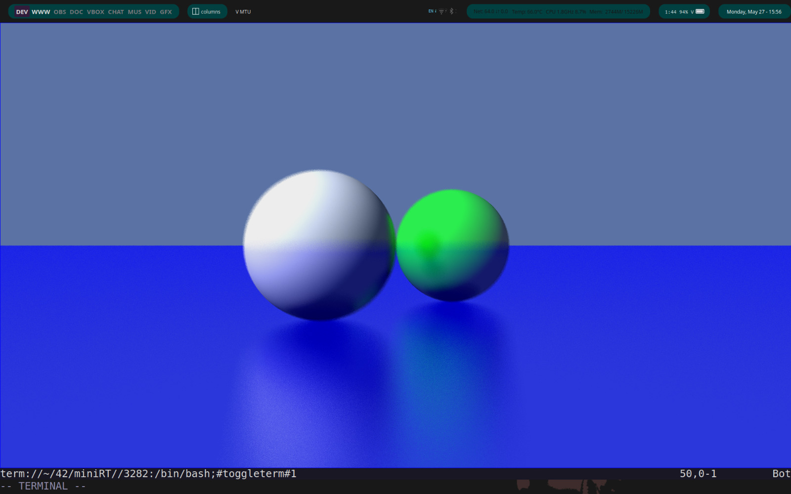

# Project Name



This project is part of the École 42 curriculum. It focuses on ray tracing.

---

## Requirements

- [List dependencies, e.g., GCC, Make, etc.]

---

## Installation

1. Clone the repository:
  ```bash
  git clone https://github.com/your-username/project-name.git
  ```
2.Navigate to the project directory:
  ``` bash
  cd project-name
  ```
3. Compile the project:
  ``` bash
  make
  ```
## Usage
Run the project:
  ``` bash
  ./executable_name [arguments]
  ```

